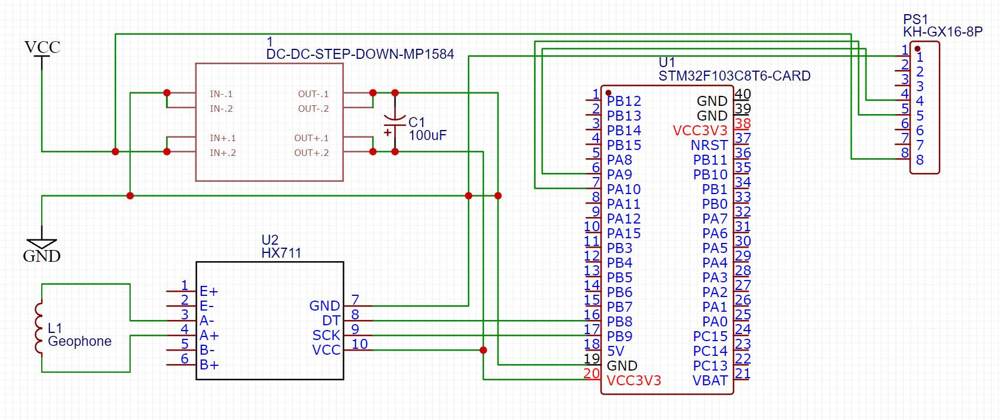
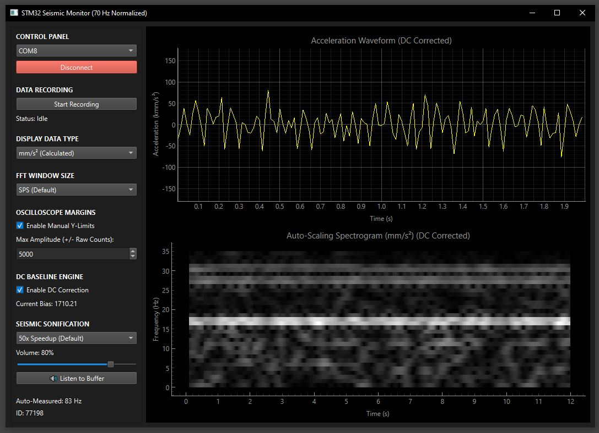

# STM32 Seismic Monitor & Sonification Suite

An end-to-end telemetry system designed to capture, visualize, record, and sonify low-frequency seismic activity. The system pairs custom STM32 microsecond-accurate sensor acquisition firmware with a responsive desktop GUI.

## Key Features

* **High-Speed STM32 Firmware:** Bit-bangs 24-bit sensor channels (e.g., `PB8 DOUT` / `PB9 SCK`) with 64x gain hardware timing guards and streams 4-element CSV frames over 500,000 baud serial.
* **Real-time Visualization:** Built on `PyQt6` and `pyqtgraph` to render low-latency time-domain acceleration waveforms ($\text{mm/s}^2$) and dynamic auto-scaling spectrograms.
* **Seismic Sonification Engine:** Resamples and compresses low-frequency seismic buffer history into audible frequencies using adjustable speedup multipliers ($5\times$ to $100\times$) and 16-bit PCM WAV playback.
* **Continuous DC Baseline Tracking:** Implements an inline exponential smoothing filter ($\alpha = 0.005$) to dynamically track and eliminate DC bias drift in real time.
* **Data Telemetry Logging:** Background CSV recording engine that logs Unix timestamps, packet IDs, raw ADC counts, DC-corrected values, and calibrated acceleration.
* **Oscilloscope & FFT Controls:** Adjustable power-of-two FFT window sizes, auto-calculated Nyquist bounds, auto-measured sample rates (~70 Hz nominal), and manual Y-axis amplitude scaling.

## System Architecture

* **Hardware / Firmware (`Infrasound Lab`):** Interfaces with the 24-bit sensor on STM32 pins `PB8`/`PB9`, handles Two's Complement sign extensions, and outputs high-throughput serial frames.
* **Desktop GUI (`seis2sound.py`):** Python application that manages the serial accumulator, dynamic ring buffers (up to 40,000 samples), digital filtering, spectral transformations, and audio rendering.
* 

## Tech Stack

* **Firmware:** C++ / STM32 (Arduino core)
* **GUI & Plotting:** Python 3, PyQt6, pyqtgraph
* **Signal Processing & Audio:** NumPy, PySerial, Wave, Winsound

Quick Start
Flash the firmware onto your STM32 target.  
Install Python dependencies:
```bash
# Clone the repository and install requirements
git clone [https://github.com/your-username/stm32-seismic-monitor.git](https://github.com/your-username/stm32-seismic-monitor.git)
cd stm32-seismic-monitor
pip install PyQt6 pyqtgraph pyserial numpy
```
An end-to-end telemetry system designed to capture, visualize, record, and sonify low-frequency seismic activity. The system pairs custom STM32 microsecond-accurate sensor acquisition firmware with a responsive desktop GUI.

---

## Key Features

* **High-Speed STM32 Firmware (80 Hz Nominal):** Bit-bangs 24-bit differential sensor channels (e.g., HX711 on `PA0 DOUT` / `PA1 SCK` or `PB8 DOUT` / `PB9 SCK`) with high-gain hardware timing guards to eliminate CPU scheduling jitter.
* **Structured Serial Telemetry:** Streams CSV data frames over high-speed UART (115,200 to 500,000 baud), enabling sequence continuity tracking and zero-dropped-frame detection.
* **Real-Time Dual Visualization:** Built on `PyQt6` and `pyqtgraph` to render low-latency time-domain acceleration/millivolt waveforms and dynamic auto-scaling spectrograms.
* **Continuous DC Baseline Engine:** Implements an inline exponential smoothing filter ($\alpha = 0.005$) to dynamically track, offset, and eliminate DC bias drift in real time.
* **Seismic Sonification Engine:** Resamples low-frequency seismic buffer history into audible frequencies using adjustable speedup multipliers ($1\times$ to $5\times$) with custom volume playback controls.
* **Data Telemetry Logging:** Background CSV engine logging Unix timestamps, packet IDs, raw ADC counts, DC-corrected values, and calibrated millivolts/acceleration metrics.
* **Interactive GUI Controls:** Features manual Y-axis amplitude locking, auto-scaling spectrogram bounds, configurable FFT window sizes, manual/auto baseline toggles, and direct buffer audio playback.

---

## Architecture & Data Flow
  +-------------------------------------------------------------+
  |                   HARDWARE ACQUISITION                      |
  |                                                             |
  |  [ Geophone / Load Cell Sensor ]                            |
  |            |                                                |
  |            v                                                |
  |  [ HX711 24-bit ADC Module ] (RATE set to VCC for 80 Hz)    |
  |      - Data Pins: DOUT / SCK                                |
  |            |                                                |
  |            v                                                |
  |  [ STM32 Microcontroller ]                                  |
  |      - 24-bit Two's Complement Bit-Banging                  |
  |      - High-Gain Timing Guards & Auto-Resync Bus Recovery   |
  +------------------------------+------------------------------+
                                 |
                                 | UART Stream (115200 Baud)
                                 | Protocol: PACKET_ID,RAW,MILLIVOLTS\n
                                 v
  +-------------------------------------------------------------+
  |                    DESKTOP / EDGE GUI                       |
  |                                                             |
  |  [ Serial Accumulator & Sequence Tracker ]                  |
  |            |                                                |
  |            v                                                |
  |  [ DC Baseline Removal Filter Engine ]                      |
  |            |                                                |
  |            +-----------------------+                        |
  |            |                       |                        |
  |            v                       v                        |
  |  [ Time-Series Waveform ]  [ Auto-Scaling Spectrogram ]     |
  |            |                                                |
  |            v                                                |
  |  [ Audio Resampler / Seismic Sonification Audio Engine ]    |
  +-------------------------------------------------------------+

## User Interface Overview

* 

* **Establish Connection: Select your serial COM port (e.g., COM8) in the Control Panel and click Connect.
* **Zero Offset: Ensure Enable DC Correction under DC Baseline Engine is active to continuously subtract baseline offset (Current Bias) from incoming raw counts.
* **Manual Scaling: Toggle Enable Manual Y-Limits and enter an amplitude threshold (e.g., 5000) to lock vertical scaling on the top oscilloscope view.
* **Data Logging: Click Start Recording under Data Recording to begin caching raw ADC counts, DC-corrected values, and calibrated metrics into a local memory buffer and CSV log.
* **Sonify Buffer: Under Seismic Sonification, select a playback rate (e.g., 5x Speedup), adjust the volume slider, and click Listen to Buffer to pitch-shift low-frequency seismic waves into the audible spectrum.
